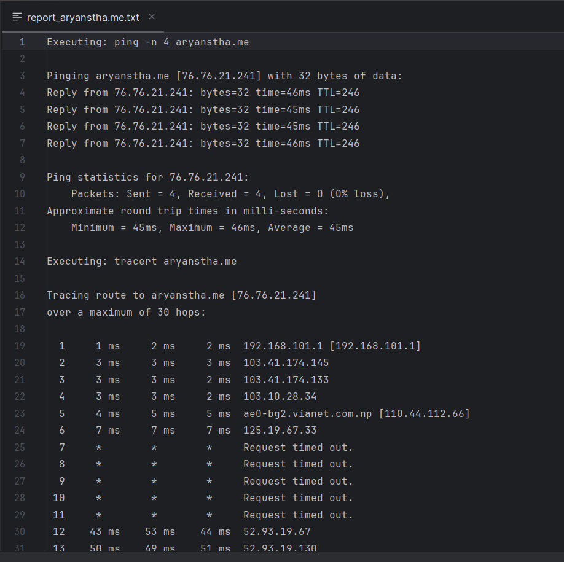

<h1 align="center" id="title">Automated Network Tools in C++</h1>

<p id="description">This project is a simple automation tool for running common network commands like ping tracert and nslookup on a target using C++. The tool provides a convenient way to execute these commands and export the results to a report file.</p>

<h2>Project Screenshots:</h2>




  
  
<h2>🧐 Features</h2>

Here're some of the project's best features:

*   Automates \`ping\` \`tracert\` and \`nslookup\` commands.
*   Generates a report summarizing the results.
*   Simple command-line interface.

<h2>🛠️ Installation Steps:</h2>

<p>1. Cloning repository</p>

```
git clone https://github.com/Aryanstha/NetTool.git
```

<p>2. Navigate to project Directory.</p>

```
cd NetTool
```

<p>3. Compile</p>

```
g++ netscan.cpp -o netscan -lws2_32
```

<p>4. Run</p>

```
 ./netscan.exe 
```

  
  
<h2>💻 Built with</h2>

Technologies used in the project:

*   C++
